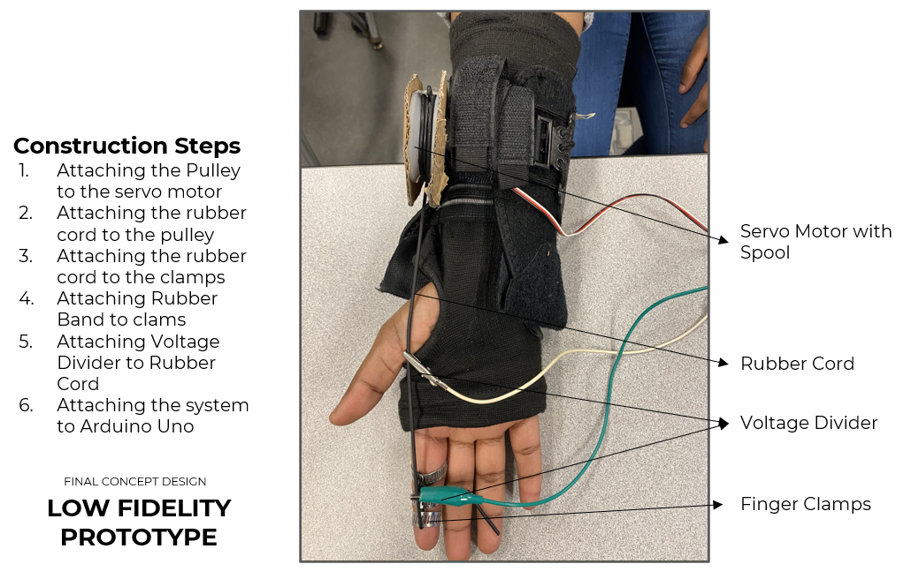

# Stroke Rehab Glove Prototype

A low-fidelity wearable rehabilitation glove prototype designed to assist finger flexion/extension after stroke using servo-driven actuation, a rubber cord transmission mechanism, resistance sensing, and Arduino-based data logging.

## Prototype Overview

  

This project explores a low-cost assistive glove concept for post-stroke hand rehabilitation. The prototype uses a servo motor and pulley/spool mechanism to apply controlled tension to a rubber cord attached to the finger. A voltage divider circuit is used to estimate resistance changes in the rubber cord during movement trials, allowing resistance-over-time data to be logged and visualized.

The goal of the prototype was to demonstrate a functional proof of concept that combines:

- wearable mechanical assistance
- Arduino-based motor control
- resistance-based sensing
- serial data collection
- Python-based trial visualization
- mechanical design validation through prototyping and analysis

## Motivation

Hand dysfunction is a common persisting consequence after stroke, and repetitive assisted movement can support rehabilitation practice. This prototype was done as a biomedical engineering design project to help simulate repeated finger-opening and finger-closing exercises while producing data that could help track rehabilitation progress.

## Features

- Servo-driven pulley/spool mechanism for assisted finger movement
- Rubber cord transmission for pulling motion
- Finger clamps/rings used to route and apply tension to the finger
- Elastic/rubber return elements to support extension/flexion motion
- Voltage divider circuit for resistance-based measurement
- Arduino firmware for motor actuation and serial data logging
- Python analysis script for resistance-versus-time plots
- Sample CSV trial data and generated result plots
- Prototype images, functional diagrams, and design documentation

## Prototype Demo

  

## Hardware

- Arduino Uno
- Continuous rotation servo motor
- Pulley/spool mechanism
- Carbon black conductive rubber
- Finger clamps/rings
- Voltage divider circuit
- Glove base
- Jumper wires/alligator clips

## Software

- Arduino C/C++
- Python
- pandas
- matplotlib